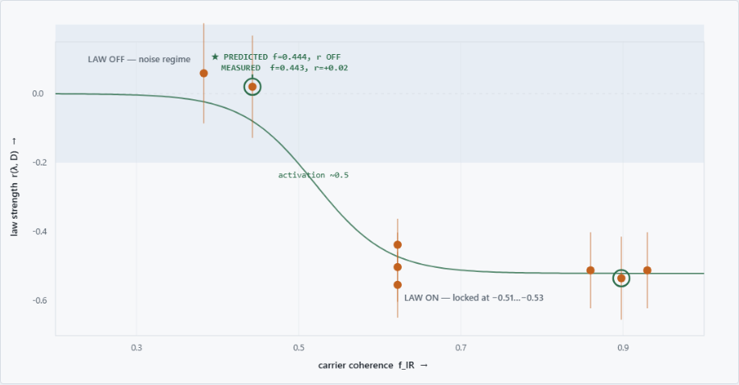
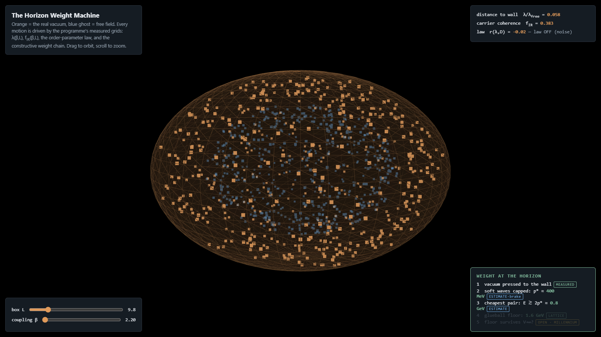

# Measured geometry and horizon dynamics of the SU(2) gauge orbit space

First direct Monte Carlo measurements of the Riemannian geometry of the SU(2) gauge orbit
space on lattice ensembles, and of the dynamics of the approach to the Gribov horizon —
including a per-configuration coupling law verified by a pre-registered out-of-sample
prediction.

**Part II** (runs 12–19: the boundary half — horizon dynamics, blind per-configuration laws, the refined-GZ scale and its unresolved continuum status):
[github.com/hooamaai-create/su2-orbit-space-ii](https://github.com/hooamaai-create/su2-orbit-space-ii)

**Paper:** [`paper/main.tex`](paper/main.tex) · **Reading guide to the record:**
[`record/GUIDE.md`](record/GUIDE.md)

## The results, one line each

1. **The curvature sector is scale-free** — effective mass dimensions bounded at
   `|n| ≤ 0.02–0.03` (a mass-generating quantity requires `n = 1`), and the metric is
   provably (`Δ ⪰ M†L⁻¹M`) and measurably (`r = 0.009`) blind to the horizon. Singer's
   curvature route to the mass gap closes, with a mechanism.
2. **The curvature sector's numbers are disorder constants** — Haar-random links
   reproduce the interacting values to <1% (`K·V = 0.0794`;
   `tr Ric/tr T = 0.81576(2)`, volume-stable to 2×10⁻⁵).
3. **The lowest Faddeev–Popov mode has a localization→coherence crossover**
   (`IPR·V: 8.7 → 1.2`, `f_IR: 0.36 → 0.95`), coupling-driven (it persists at fixed
   physical volume); the boundary is a sloped curve in the (coupling, box-size) plane.
4. **A coherence-gated correlation** — the per-configuration correlation between
   horizon proximity `λ_min(M)` and infrared gluon power `D(p_min)` depends on the
   carrier's coherence alone: absent below `f_IR ≈ 0.5`, locked at `r = −0.51…−0.53`
   above `≈ 0.6`. Verified twice over: run 10 predicted, in advance, that the
   correlation — strong at `(β, L) = (2.4, 10)` — would **vanish at `(2.4, 16)`**
   (`f_IR` predicted 0.444, measured 0.443(16); `r` measured +0.02); run 11 then
   tested the **curve's shape blind** — twelve ensembles spanning `f_IR = 0.31–0.91`
   (including β = 2.5, never previously measured), all twelve predictions logged
   before any correlation was computed — and the zero-parameter curve fit at
   **χ²/dof = 1.00**. One pre-registered control failed honestly: our non-spectral
   coherence observable proved volume-dominated, so whether `f_IR` is fundamental or
   a proxy remains open (`record/RUN11_SPEC.md`), and we claim a coherence-gated
   correlation, not a law.
5. **Horizon dynamics** — the ensemble is driven to the horizon 4.8σ faster than
   kinematics (`λ_min ~ L^−3.08(25)` vs free `L^−1.90`, Gribov-copy systematic bounded at
   0.16σ), with a braking window bracketed near `ℓ* ≈ 7±2` in `1/√σ` units at β=2.2.

## Live instruments (no install)

- **[The Horizon Weight Machine](https://hooamaai-create.github.io/su2-orbit-space/viz/tool.html)** —
  three.js, driven by the measured grids: orbit the space, slide (beta, L), watch the vacuum
  press the wall, the law switch, and the weight chain light up
- **[The law, drawn from data](https://hooamaai-create.github.io/su2-orbit-space/viz/law.html)** —
  every r measurement vs coherence, predictions ringed
- **[The mechanism walkthrough](https://hooamaai-create.github.io/su2-orbit-space/viz/index.html)** —
  the full story in four interactive 2D scenes

## Reproduce the decisive prediction — free GPU, one afternoon

(This reproduces run 10 — the out-of-sample prediction — on our engine. Independent
reproduction of the full chain (sampler → gauge fixing → spectra → correlation) from
scratch is the stronger test, and `core/` is organized to make that feasible.)

The decisive experiment (run 10, the out-of-sample prediction) is one notebook:

1. Upload [`gpu/kaggle_order.ipynb`](gpu/kaggle_order.ipynb) to [kaggle.com](https://www.kaggle.com)
   (free account), Settings → Accelerator → GPU.
2. Set `FAST = True`, Run All (~10 min smoke test; built-in gates must PASS).
3. Set `FAST = False`, Run All (~5–7 h). It writes `results10.json`.
4. Compare against [`results/results10.json`](results/results10.json): the prediction
   either holds or it doesn't.

Every GPU notebook is self-contained (the physics engine is embedded; a guard cell
handles P100/T4 differences automatically) and aborts if its validation gates fail.

## Repository layout

| dir | contents |
|---|---|
| `core/` | the validated instruments: lattice + sampler (heat-bath cross-checked), Landau fixing, deflated FP solver, curvature closed form, **`validate_stack.py`** — run this first; no measurement is trusted on a stack that hasn't passed its 7 checks |
| `analysis/` | the analyses behind the paper's tables (phase portrait, disorder-constant tests, dimension scans) |
| `gpu/` | the seven Kaggle runs (engine + notebooks), gates included |
| `results/` | raw JSON outputs of the braking and prediction runs |
| `record/` | **`LEDGER.md`** — the append-only research record: every claim's falsifier fixed before its data, every correction dated in place. `GUIDE.md` maps the ~20 load-bearing entries to the paper. |
| `paper/` | the manuscript (LaTeX) |
| `viz/` | interactive: the mechanism walkthrough (`index.html`), the law drawn from data (`law.html`), and a three.js instrument driven by the measured grids (`tool.html`) |

## Multiplicity, stated up front

Fourteen mechanisms and patterns were formulated during this work; **thirteen were
refuted by their own pre-registered tests** (all documented, with falsifiers and dates, in
`record/LEDGER.md`). The coherence law is the survivor, and its out-of-sample prediction
was made after that accounting. Thirteen instrument bugs were caught during the
programme — every one by a pre-registered check or independent audit, none by code
inspection; the validation suite exists so the fourteenth is caught the same way.

## Scope and non-claims

SU(2) only; one lattice spacing per coupling; boxes up to `L a√σ ≈ 10`; no independent
reproduction yet (hence the invitation above). **Nothing here bears on the existence of
the Yang–Mills mass gap at infinite volume.**

## Credit

Research by Nitin Pandey (independent), conducted in close collaboration with Claude
(Anthropic), which performed analysis, code, and drafting under the author's direction.

License: MIT (code); CC-BY-4.0 (text and figures).
